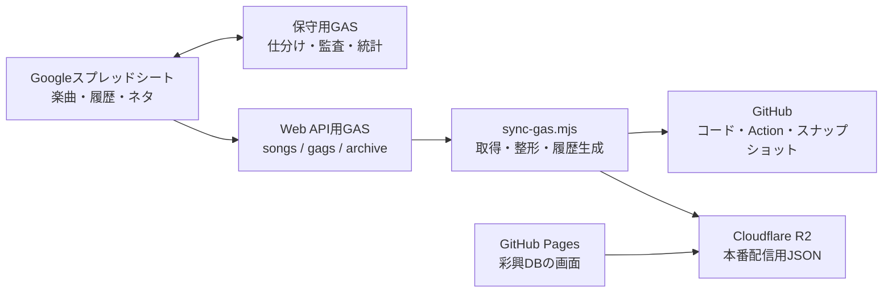

# 彩興DB（kasane-3kHz-songsDB）

[彩興DBを開く](https://performancerecord.github.io/kasane-3khz-songsDB/)

彩興DBは、Vtuber「花彩音_3kHz」の歌唱楽曲・歌唱履歴・企画／一発ネタを検索、閲覧、再生するための静的Webアプリケーションです。

このREADMEは、2026年9月3日時点の本番コード、Google Apps Script（GAS）、同期スクリプト、GitHub Actionsを照合してまとめた現行仕様です。今後仕様を変更する場合は、実装と同時にこのREADMEも更新してください。過去の判断や移行状況は [`PROGRESS.md`](./PROGRESS.md) に記録しています。

## 1. システム全体像

業務データの原本はGoogleスプレッドシート、本番配信用データの正はCloudflare R2です。GitHubはソースコード、GASの保存用コピー、同期処理、配信用JSONのスナップショットを管理します。



本番画面はスプレッドシートやGAS APIを直接読みません。画面の一覧はR2上の `songs.json` と `gags.json`、履歴は各行の `historyRef` が指す `history/<id>.json` から取得します。これにより、閲覧時のGAS負荷と実行時間制限の影響を避けています。

## 2. DBアプリの要件と機能

### 2.1 一覧・検索

- 初期表示では「歌枠」「歌ってみた」「ショート」の3区分をすべて表示します。
- 3区分は複数選択できます。
- 「ネタ」は `gags.json` を使う独立表示です。ネタ表示中は楽曲区分の一覧を表示しません。
- 検索対象は曲名とアーティスト名です。英字の大文字・小文字を区別せず、連続する空白を1文字として検索します。
- 一覧件数、選択中の区分、データ取得状態を画面に表示します。
- データが0件の場合は「該当する項目がありません。」と表示します。

### 2.2 楽曲情報カード

各カードには次の情報と操作を表示します。

- 曲名：カード内で主情報として太字で表示
- アーティスト名：曲名より小さい補助情報として表示
- 区分と最新歌唱日
- YouTubeサムネイル（利用可能なURLの場合のみ、遅延読み込み）
- 歌唱履歴を開くアイコン
- `曲名 / アーティスト名` をクリップボードへコピーするアイコン

文字による「履歴を見る」は表示せず、履歴操作はアイコンとカード操作に統一しています。

### 2.3 歌唱履歴

- `historyRef` のJSONを選択時に取得し、歌唱日が新しい順に表示します。
- URLがある履歴は新しいタブでYouTubeを開きます。
- URLがない履歴は「リンクなし」と表示します。
- 画面幅が1100px以上の場合は、一覧の右側に専用履歴パネルを表示します。
- 1100px未満の場合は、選択したカード内に履歴を展開します。
- 同時に開くインライン履歴は1件だけです。

### 2.4 YouTubeプレイヤー

プレイヤーは表示・非表示を切り替えられます。

- プレイヤー非表示時：カードまたはサムネイルを選ぶと履歴を開く
- プレイヤー表示時：カードまたはサムネイルを選ぶと、その時点の絞り込み結果を再生キューとして動画を再生する
- 前の曲／次の曲
- 10秒戻る／10秒進む
- 再生／一時停止
- 音量調整
- ランダム再生
- リピート切替（オフ → 1曲 → 全体）
- URL内の `t` または `start` を開始位置として利用
- 再生中のアーティスト名を選ぶと、そのアーティストで一覧を絞り込む。再生自体は継続する

対応するYouTube URL形式は `youtube.com/watch`、`youtu.be`、`shorts`、`live`、`embed` です。削除済み、非公開、埋め込み禁止などの動画は、YouTubeから返された状態に応じてエラーを表示します。

### 2.5 弾幕コピー

用意された4種類の弾幕から1つを選び、クリップボードへコピーできます。モバイルでは画面下部に固定し、セーフエリアを考慮します。

### 2.6 レスポンシブUIと軽量エフェクト

- 1100px以上：左側にスクロール可能な一覧、右側に検索・プレイヤー・履歴・弾幕コピーを配置した2ペイン構成
- 1100px未満：1カラム構成で履歴をカード内に表示
- 760px以下：プレイヤー操作とカード右側のサムネイル／操作領域を小画面向けに縮小
- 700px以下：検索・状態表示を縦方向に配置し、弾幕コピーを画面下部に固定
- 380px以下：再生中表示やカードの幅をさらに調整
- プレイヤーの開閉とモバイル履歴の展開だけに短いアニメーションを使用
- OS／ブラウザの `prefers-reduced-motion` が有効な場合は主要なアニメーションを停止

Web App Manifestとアプリアイコンを用意していますが、Service Workerによるオフラインキャッシュは実装していません。オフライン利用を前提としたアプリではありません。

## 3. 本番フロントエンドの構成

本番入口はルートの [`index.html`](./index.html) です。現在は承認済みのv2資産を読み込みます。

| 役割 | 本番で使用するファイル |
| --- | --- |
| HTML | `index.html` |
| スタイル | `v2/assets/css/app-v2-inline-history.css` |
| 一覧・検索・履歴 | `v2/assets/js/app-v2-inline-history.js` |
| YouTubeキュー・再生操作 | `v2/assets/js/player-queue-v2.js` |
| 弾幕コピー | `v2/assets/js/danmaku-copy.js` |
| Web App Manifest | `site.webmanifest` |

`v2/index.html` は確認用ページとして保持しています。ルートの `assets/` は旧UIの資産であり、現在の本番ルートからは読み込まれません。

### 配信データURLの決定順

フロントエンドは次の順序でJSONの基準URLを決めます。

1. URLクエリ `?static_base=...`
2. `localStorage` の `staticDataBase`
3. コードに設定された本番R2の `public-data/` URL

`static_base` は末尾を `public-data/` としたURLを指定してください。相対 `historyRef` はこのURLを基準に解決します。

## 4. スプレッドシートの要件

### 4.1 使用シート

| シート名 | 用途 | データ開始行 | DB API名 |
| --- | --- | ---: | --- |
| `歌った曲リスト` | DB一覧に残す代表データ | 4行目 | `songs` |
| `企画/一発ネタシリーズ` | ネタ一覧 | 4行目 | `gags` |
| `アーカイブ` | 同一曲の過去履歴 | 2行目 | `archive` |
| `近似情報チェック` | 表記ゆれ・重複疑いの確認結果 | GASが1行目から再生成 | なし |
| `統計` | 歌枠・ショートの回数集計 | GASが1行目から再生成 | なし |

楽曲整理の対象は `歌った曲リスト` と `アーカイブ` です。`企画/一発ネタシリーズ` はWeb APIからネタ一覧を取得するために使い、日常仕分け・総点検・近似情報チェック・統計の対象には含めません。

### 4.2 A～D列の入力形式

| 列 | 内容 | 要件 |
| --- | --- | --- |
| A | アーティスト名 | 同一楽曲判定の一部。空白や表記ゆれに注意する |
| B | 曲名 | 同一楽曲判定の一部。空白や表記ゆれに注意する |
| C | 区分 | `歌ってみた`、`歌枠`、`ショート` のいずれか |
| D | 出典元情報 | 表示文言の先頭を `YYYYMMDD` とし、動画の直リンクを持たせる |

D列の推奨例は `20260903 配信タイトル` です。日常仕分けで日付として認識するには、先頭に空白を入れず、冒頭8文字を実在する日付の数字8桁にする必要があります。

D列のURLは次の優先順で取得します。

1. リッチテキストに設定されたリンク
2. `HYPERLINK` 数式のリンク先
3. セル表示文言内の `http://` または `https://` URL

URL比較では、前後空白を除いたURL全体を使います。YouTubeのタイムスタンプも比較対象なので、同じ動画でも開始位置が異なるURLは別データです。

`歌った曲リスト` のE・F列に既存の補助情報がある場合、日常仕分けと総点検は値を保持します。ただしDB APIへ渡すのはA～D列だけです。`アーカイブ` はA～D列を管理します。

### 4.3 同一楽曲の正規化

日常仕分け・総点検では、A列とB列を次のように正規化してから同一楽曲を判定します。

- Unicode NFKC正規化
- 全角空白を半角空白へ変換
- 連続する空白を1文字へ統合
- 複数種類のハイフン／長音記号を `-` へ統一
- 前後空白を除去
- 英字を小文字化

近似情報チェックでは、これに加えて空白、ゼロ幅文字、ハイフン、中点、アンダースコア、スラッシュを除去した比較も行います。

## 5. スプレッドシート保守用GAS

実運用スクリプトのGitHub上の正本は [`google-apps-script-reference/merge-songs-gags-archive.gs`](./google-apps-script-reference/merge-songs-gags-archive.gs) です。GitHubからApps Scriptへの自動デプロイは行いません。変更後は実運用のApps Scriptプロジェクトへ手動で反映してください。

スプレッドシートを開くと「仕分け」メニューに次の4機能を表示します。

1. `重複を仕分け（日常用）`
2. `完全重複を総点検`
3. `近似情報をチェック`
4. `統計シートを作成・更新`

動画監査機能と統合一覧再構築は、現行メニューの要件には含みません。

### 5.1 重複を仕分け（日常用）

日常用処理は、新規行の有無にかかわらず毎回 `歌った曲リスト` と `アーカイブ` の全行を検査します。

処理順は次のとおりです。

1. `歌った曲リスト` 内で、正規化したA＋Bと完全なD列URLが一致する行を1件にする
2. 同じA＋B＋C＋投稿日でURLだけが異なる再アップロードを1件にする
3. `歌った曲リスト` 内の同一A＋Bについて、`歌ってみた > 歌枠 > ショート` の優先度で代表1件を決める
4. 同一区分が複数ある場合は、D列先頭の日付が最も新しい行を代表にする
5. 代表以外を `アーカイブ` へ移動する
6. 移動後の `アーカイブ` 内でも、完全重複と同区分・同日再アップロードを整理する

補足要件は次のとおりです。

- 完全重複キーはA＋B＋完全URLです。C列とD列表示文言はキーに含めません。
- URLが空の行は完全重複として削除しません。
- 完全URLが同じで区分が異なる場合は、区分優先度が高い行を残します。
- 再アップロード判定はA＋B＋C＋D列先頭8桁の日付で行います。
- 新規データの判定にはDocument Propertiesの前回メイン最終行を使います。前回位置より下に追記された行を新規とみなし、新規候補を優先します。
- 新規候補が複数ある場合は、より下の行を新しいものとします。
- 初回は全メイン行を新規候補として扱い、同条件なら下の行を優先します。
- `歌った曲リスト` から今回移動した行と既存アーカイブ行が再アップロード関係の場合は、今回移動した行を新しいものとして扱います。
- `アーカイブ` 内では区分優先度による1件化を行わず、アーカイブ行をメインへ戻しません。
- 重複のない行は所属と相対的な並び順を維持します。
- 重複グループに不正な日付がある場合はD列を、不正な区分がある場合はC列を赤くして処理を中止します。
- 書き換えが発生しない場合は、バックアップ作成とシート再書き込みを省略します。

### 5.2 完全重複を総点検

総点検は `歌った曲リスト` と `アーカイブ` を横断し、正規化したA＋Bと完全なD列URLが一致する行だけを削除します。

- 両シートに同じデータがある場合は `歌った曲リスト` を残し、`アーカイブ` 側を優先して削除します。
- 同一シート内の重複は、上にある行を残します。
- URLが空の行は削除しません。
- 区分優先度による移動、再アップロード置換、メイン／アーカイブ間の再配置は行いません。
- 削除がない場合はバックアップと書き換えを行いません。

### 5.3 近似情報をチェック

両シートの全データを総当たりで比較し、疑わしい組み合わせを `近似情報チェック` シートへ再出力します。元データは変更しません。

検出条件は次のとおりです。

- アーティスト名と曲名が入れ替わっている
- 空白、ハイフン、中点などの区切り記号を除くと一致する
- アーティスト名と曲名が、それぞれ70%以上一致する
- A＋Bは異なるが、タイムスタンプを含む完全URLが一致する
- `歌った曲リスト` 内にA＋B完全一致の行が残っている

結果には、判定理由、最低類似度、項目別類似度、双方のシート名・行番号・A～D列・URLを出力します。同じ楽曲の代表行と過去履歴を誤検出しないため、メインとアーカイブ間、またはアーカイブ内のA＋B完全一致だけでは指摘しません。

### 5.4 統計シートを作成・更新

`歌った曲リスト` と `アーカイブ` を合算し、A＋Bごとに次の項目を集計して `統計` シートを再生成します。

- 合計（歌枠＋ショート）
- 歌枠のみ
- ショートのみ

現在の統計処理では `歌ってみた` を件数に含めません。合計の多い順、同数の場合はアーティスト名、曲名の順に並べます。

### 5.5 排他制御とバックアップ

- 日常仕分け、総点検、近似情報チェックはDocument Lockを取得し、同時実行を防ぎます。
- ロック待機時間は30秒です。
- 日常仕分けまたは総点検で書き換えが発生する直前に、メインとアーカイブの非表示コピーを作ります。
- バックアップ名は `_backup_<元シート名>_<日時>` 形式です。
- 各シートのバックアップは直近5世代を保持します。

## 6. DB公開用GAS API

Web APIの保存用正本は [`google-apps-script-reference/code.gs`](./google-apps-script-reference/code.gs) です。このファイルもApps Scriptへ手動反映し、ウェブアプリとしてデプロイします。別のスプレッドシートへ移す場合は `CFG.SHEET_ID` とシート名・開始行を更新してください。

### リクエスト

```text
GET <GAS_URL>?sheet=songs|gags|archive
```

主なクエリパラメータは次のとおりです。

| パラメータ | 内容 |
| --- | --- |
| `sheet` | `songs`、`gags`、`archive`。省略時は `songs` |
| `q` | アーティスト名または曲名の部分一致 |
| `artist` / `title` / `exact=1` | アーティスト名＋曲名の完全一致 |
| `limit` / `offset` | オフセットページング |
| `afterDate8` / `afterKey` | archiveのカーソルページング |
| `debug=1` | URL取得元 `dSrc` を行データへ追加 |
| `callback` | 有効な関数名の場合のみJSONPで返却 |

1回の返却上限は各シート5000件で、GAS側のキャッシュ時間は60秒です。そのため、スプレッドシート編集直後はAPIへの反映に最大60秒程度の遅れが生じることがあります。

### レスポンス

次はレスポンス形式の例です。`total`、`matched`、`limit` はリクエスト時点のデータと指定値によって変わります。

```json
{
  "ok": true,
  "sheet": "songs",
  "total": 639,
  "matched": 639,
  "offset": 0,
  "limit": 500,
  "rows": []
}
```

`rows` の基本項目は次のとおりです。

| 項目 | 内容 |
| --- | --- |
| `artist` | A列アーティスト名 |
| `title` | B列曲名 |
| `kind` | C列区分 |
| `dText` | D列表示文言 |
| `dUrl` | D列から抽出したURL |
| `date8` | D列先頭8文字から得た `YYYYMMDD` 数値。不正または未設定は0 |
| `rowId` | アーティスト＋曲名＋区分＋完全URLから作る行識別子 |
| `dSrc` | `debug=1` の場合のみ。URLの取得元 |

APIは `rowId` が同じ返却行を1件にし、通常の応答では `date8` の新しい順に並べます。

## 7. GASから配信用JSONへの変換

[`scripts/sync-gas.mjs`](./scripts/sync-gas.mjs) がGAS APIを取得し、`public-data/` に配信用データを生成します。Node.js 20以上を想定しています。

### 生成物

| ファイル | 用途 | 本番画面からの利用 |
| --- | --- | --- |
| `songs.json` | 楽曲一覧 | 起動時に取得 |
| `gags.json` | ネタ一覧 | 起動時に取得 |
| `meta.json` | 同期モード、件数、履歴生成状況 | 現在の画面は直接使用しない |
| `history/<id>.json` | 同一アーティスト＋曲名の歌唱履歴 | 履歴を開いた時に取得 |
| `archive.json` | 履歴生成用のアーカイブスナップショット | 画面では取得しない |
| `archive-crawl-state.json` | archiveローリング巡回のカーソル | 画面では取得しない |

`public-data/history/` と新規の `public-data/archive.json` は `.gitignore` の対象です。ただし、すでにGit追跡されている `archive.json` はスナップショット更新時に引き続き更新されます。履歴JSONはGitHubへ保存せず、同期実行中に生成してR2へ配置します。

### 履歴の作り方

- 履歴グループは、小文字化して前後空白を除いた `artist | title` で作ります。
- 区分とURLは履歴グループの条件に含めません。
- 履歴IDは履歴キーのSHA-1先頭12文字で決定するため、同じキーから同じファイル名を生成します。
- archiveの履歴を日付の新しい順に格納します。
- archiveに該当行がなくても、`songs` と `gags` の各行に最低1件の履歴JSONを生成します。
- 一覧行へ `historyRef`、`historyCount`、`lastSungAt` を追加します。

### 通常同期

- `songs` は500件ずつページングし、`SONGS_MAX_PAGES`（既定20）を超えそうな場合は欠損データを保存せず失敗します。
- `gags` は通常1回で取得します。
- archive同期を有効にした場合は、1回の実行で1バッチだけカーソルを進めます。
- archiveのバッチ数は既存件数のおよそ7分の1を基準とし、50～500件の範囲、件数不明時は150件です。
- archive取得結果は既存 `archive.json` へ追記・更新し、`archive-crawl-state.json` に次のカーソルを保存します。
- archive同期を無効にしたローカル実行では、既存 `archive.json` があれば履歴生成に使用し、なければ一覧行だけから1件履歴を生成します。
- `ARCHIVE_STRICT_SYNC=true` の場合はarchive取得失敗を処理全体の失敗とし、無効の場合は既存スナップショットを維持します。

### 手動完全再取得

`FULL_REFRESH=true` では `songs`、`gags`、`archive` を既存JSONへ継ぎ足さず、先頭から全件取得します。このモードには `ENABLE_ARCHIVE_SYNC=true` と `ARCHIVE_STRICT_SYNC=true` が必須です。

GitHub Actionでは1ページ200件、最大100ページ、シートごとの安全上限20000件に設定しています。取得中に `total`／`matched` が変化した場合、重複する `rowId` を検出した場合、または取得件数が `matched` と一致しない場合はR2更新前に停止します。

## 8. GitHub Actionsによる運用

### 8.1 通常運用

| Action | 起動条件 | 主な処理 |
| --- | --- | --- |
| `Sync GAS data` | 毎日09:00 JST、手動 | GASからGitHub上のスナップショットを更新。定期実行ではarchiveを1バッチ巡回 |
| `Sync GAS snapshot to Cloudflare R2` | 毎日13:00 JST、手動 | GASから厳格モードで再生成し、`songs/gags/meta/history` をR2へ配置 |
| `Validate history artifacts` | `main` へのpush、Pull Request | GASから生成し、全一覧に `historyRef` があり履歴JSONが生成できることを検証。fork PRはSecretsを使えないためスキップ |

R2通常同期は `history/` に対して `--delete` を指定します。その実行で生成されなかった古い履歴JSONは、アップロードと同時にR2から削除されます。`songs.json`、`gags.json`、`meta.json` は個別に上書きします。通常同期にはR2全体の事前バックアップ処理はありません。

### 8.2 「マニュアルでアップロードデータの整理を行う」

年に数回、スプレッドシートとR2を完全に合わせ直すための手動専用Actionです。

1. GitHub Actionsで `マニュアルでアップロードデータの整理を行う` を開く
2. `Run workflow` を選ぶ
3. `confirm_refresh` を有効にして実行する

処理内容は次のとおりです。

1. `songs`、`gags`、`archive` を全ページ取得
2. 件数、行ID、全 `historyRef`、履歴JSONを検証
3. 新しい `songs/gags/meta/archive/archive-crawl-state` を `main` へコミット
4. 現在のR2 `public-data/` 全体を `backups/manual-full-refresh/<run-id>-<run-attempt>/public-data/` へ退避
5. 新しい履歴を先に追加
6. `songs/gags/meta` を更新
7. `history/` を `--delete` 付きで完全同期し、スプレッドシート由来データに存在しない履歴を削除
8. R2から再取得し、ローカル生成物との完全一致を検証

このActionは `archive.json` を履歴生成とGitHubスナップショット更新に使いますが、本番R2へ公開する対象は `songs/gags/meta/history` です。

オフセットページング中に行の追加、削除、並べ替えが起きるとページ境界が変わるため、Action実行中は対象スプレッドシートを編集しないでください。通常R2同期と手動完全整理は同じ排他グループを使い、同時実行しません。

### 8.3 必要なGitHub Secrets

| Secret | 用途 |
| --- | --- |
| `GAS_URL` | デプロイ済みGAS Web APIのURL |
| `R2_ACCESS_KEY_ID` | R2のアクセスキーID |
| `R2_SECRET_ACCESS_KEY` | R2のシークレットアクセスキー |
| `R2_ENDPOINT` | R2のS3互換エンドポイント |
| `R2_BUCKET` | 配信先バケット名 |

### 8.4 補助ワークフロー

`GAS maintenance safeguards` と `Phase 1 lightweight refactor` は、過去の限定ブランチまたはPull Request向けパッチ・回帰テスト用ワークフローです。現在の運用ルールは `main` 単一ブランチなので、通常の定期同期には使用しません。

## 9. 日常運用手順

### 楽曲データを追加する

1. `歌った曲リスト` の末尾へA～D列を入力する
2. C列を正しい区分にする
3. D列表示文言を `YYYYMMDD` で始め、直リンクを設定する
4. スプレッドシートの「仕分け」→「重複を仕分け（日常用）」を実行する
5. 必要に応じて「近似情報をチェック」と「統計シートを作成・更新」を実行する
6. 次回の定期同期後、彩興DBで件数、検索、履歴、再生位置を確認する

### GASを変更する

1. GitHub上の保存用正本を変更する
2. 回帰テストを実行する
3. `merge-songs-gags-archive.gs` をスプレッドシート側のApps Scriptへ手動反映する
4. `code.gs` を変更した場合はWeb API側へ手動反映し、必要に応じてウェブアプリを再デプロイする
5. API応答とGitHub Actionsの生成結果を確認する

Apps Script側だけを直接変更するとGitHubの正本と差が生じるため、変更内容は必ずGitHubへ戻してください。

## 10. ローカル確認

このプロジェクトはビルド不要の静的HTML／CSS／JavaScriptです。`package.json` はありません。

### 画面を確認する

リポジトリ直下を任意のHTTPサーバーで公開し、ブラウザで開きます。ファイルを直接開くと、ブラウザの制限でJSON取得に失敗することがあります。

```bash
python -m http.server 8000
```

通常はコード内の本番R2を読みます。GitHub上のスナップショットだけを確認する場合は次を使えます。

```text
http://localhost:8000/?static_base=./public-data/
```

ただし `public-data/history/` はGit追跡していないため、ローカルスナップショット指定では履歴が存在しない場合があります。

### GASデータを生成する

```bash
GAS_URL="https://script.google.com/macros/s/.../exec" node scripts/sync-gas.mjs
```

PowerShellでは環境変数を設定してから実行します。

```powershell
$env:GAS_URL = 'https://script.google.com/macros/s/.../exec'
node scripts/sync-gas.mjs
```

主な環境変数は次のとおりです。

| 変数 | 既定値 | 内容 |
| --- | ---: | --- |
| `GAS_URL` | なし | 必須。GAS Web API URL |
| `OUT_DIR` | `public-data` | 出力先 |
| `ENABLE_ARCHIVE_SYNC` | `false` | archiveをGASから取得する |
| `ARCHIVE_STRICT_SYNC` | `false` | archive取得失敗時に処理全体を失敗させる |
| `ARCHIVE_RESET_CURSOR` | `false` | archiveカーソルを先頭へ戻す |
| `ARCHIVE_FORCE_RESEED` | `false` | 既存archiveを使わず、先頭からローリング再収集を始める |
| `ARCHIVE_BATCH_SIZE_MIN` | `50` | archiveバッチ下限 |
| `ARCHIVE_BATCH_SIZE_MAX` | `500` | archiveバッチ上限 |
| `ARCHIVE_BATCH_SIZE_FALLBACK` | `150` | 件数不明時のarchiveバッチ数 |
| `SONGS_MAX_PAGES` | `20` | songsページングの安全上限 |
| `FULL_REFRESH` | `false` | 全シート完全再取得モード |
| `FULL_REFRESH_PAGE_SIZE` | `200` | 完全再取得の1ページ件数 |
| `FULL_REFRESH_MAX_PAGES` | `100` | 完全再取得の最大ページ数 |
| `FULL_REFRESH_TOTAL_CAP` | `20000` | 完全再取得のシート別件数上限 |
| `SYNC_TIMEOUT_MS` | `8000` | APIリクエストのタイムアウトms |
| `SYNC_MAX_RETRY` | `3` | APIリクエストの試行回数 |

### テスト

```bash
node --test tests/gas-maintenance.test.mjs
node --test tests/phase1-lightweight.test.mjs
node --test tests/ui-layout.test.mjs
```

2026年9月3日の確認時点では全52件中51件が成功しています。`tests/ui-layout.test.mjs` の `responsive UI landmarks are present exactly once` だけが、旧 `assets/` を対象とする期待値と本番v2のルートHTMLの差により失敗します。現状を「全テスト成功」とは扱いません。

## 11. 障害時の復旧

### 表示または通常同期に問題がある場合

1. R2の `songs.json`、`gags.json`、`meta.json` と代表的な `history/*.json` のHTTP応答を確認する
2. GitHub Pages本番で一覧、検索、履歴を確認する
3. `Sync GAS snapshot to Cloudflare R2` の最新ログとSummaryを確認する
4. R2障害の切り分けでは `?static_base=./public-data/` を使い、GitHub上の一覧スナップショットを確認する。ただし履歴JSONはGit追跡外であることに注意する
5. GASまたは一時的な通信障害なら、データを確認後に通常R2同期を再実行する

本番UI切替に問題がある場合は、ルート `index.html` を切替直前のblob SHA `beb30f47b549cd152dd7f8ee7a32d87001573f4a` へ戻せます。旧 `assets/` とR2データは保持しているため、UIロールバックだけで切り分けできます。

### 手動完全整理を戻す場合

対象ActionのSummaryに記録されたバックアップ先とスナップショットコミットを確認します。

1. 手動整理が作成したGitHubのスナップショットコミットを `git revert` する
2. R2バックアップを配信先へ復元する

```bash
aws s3 sync \
  "s3://<bucket>/backups/manual-full-refresh/<run-id>-<run-attempt>/public-data" \
  "s3://<bucket>/public-data" \
  --endpoint-url "<R2 endpoint>" \
  --region auto \
  --delete
```

実行ID、試行番号、バケット、復元先を確認してから実行してください。復元後は `songs.json` と代表的な履歴JSONを再取得し、件数と内容を確認します。手動完全整理のバックアップは自動削除しません。

### スプレッドシートの仕分けを戻す場合

非表示の `_backup_歌った曲リスト_*` と `_backup_アーカイブ_*` を表示し、実行時刻を確認して必要な範囲を復元します。上書き前に現在のシートも別途コピーしてください。

## 12. リポジトリ構成

```text
.
├─ index.html                         # 本番入口
├─ v2/                               # 現在の本番UI資産と確認用ページ
├─ assets/                           # 旧UI資産（現在の本番ルートでは未使用）
├─ public-data/                      # GitHub上のJSONスナップショット
├─ scripts/sync-gas.mjs              # GAS取得・履歴JSON生成
├─ google-apps-script-reference/
│  ├─ code.gs                        # DB公開用GAS Web API
│  ├─ merge-songs-gags-archive.gs    # スプレッドシート保守用GASの正本
│  └─ README.md                      # GAS固有仕様
├─ .github/workflows/                # 定期同期・R2同期・検証・手動完全整理
├─ tests/                            # GAS、同期、UIの回帰テスト
├─ PROGRESS.md                       # 判断履歴・移行状況・削除ゲート
└─ AGENTS.md                         # このリポジトリの作業ルール
```

`sheet_scripts/performance_record.gs` と各パッチスクリプトには過去の統合処理・移行処理が残っています。現行スプレッドシート保守機能の正本を判断するときは `google-apps-script-reference/merge-songs-gags-archive.gs` を使用してください。

## 13. データ削除に関する制約

`public-data/songs.json` は現在もGit追跡されています。GitHubから削除する場合は、[`PROGRESS.md`](./PROGRESS.md) の「削除実行ゲート」をすべて満たし、ロールバック手順を確認してから実施します。現時点では未完了のゲートがあるため削除しません。
